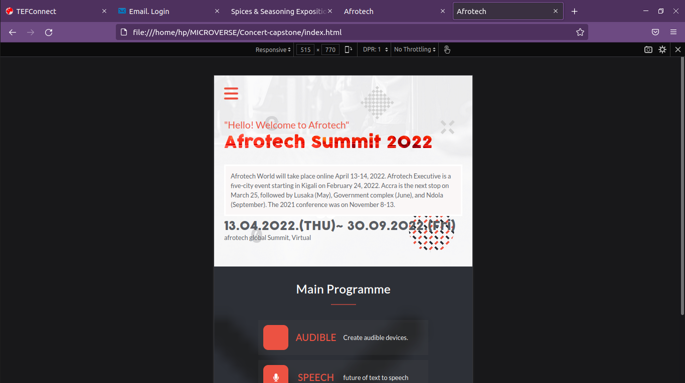

# Capstone: Kalibu's 2022 youth Summit

> This is the first capstone project from Microverse, i have managed to apply what I learned in the first module.

> The project is about Kalibu's 2022 youth Summit. The website gives information about the event
> The about-page can be accessed from the homepage with the 'About' link.

## Built With

- HTML
- CSS/Sass
- JavaScript

## Screenshot

* Desktop

* Mobile version

## Live Site URL: 

- https://misheck12.github.io/Concert-capstone/index.html

## Author

👤 **Misheck Livingi**

- GitHub: https://github.com/misheck12
- Linkedin: https://www.linkedin.com/in/misheck-livingi-a0b536142/
- Twitter : https://twitter.com/MisheckLivingi2

## 🤝 Contributing

Contributions, issues, and feature requests are welcome!

Feel free to check the [issues page](../../issues/).

## Show your support

Give a ⭐️ if you like this project!

## Acknowledgments

Cindy Shin

https://www.behance.net/adagio07

## 📝 License

This project is [MIT](./MIT.md) licensed.
